[Лабораторні](README.md)

# ЛАБОРАТОРНА РОБОТА № 3. Налаштування маршрутизатору 

**Тривалість**: 4 акад. години (2 пари).

**Мета:** Навчитися налаштовувати маршрутизатор на типові задачі

### Лабораторна установка

**Необхідне апаратне забезпечення.** 

Для проведення лабораторних робіт необхідно мати комп’ютер з наступною мінімальною апаратною конфігурацією:

- CPU Intel/AMD 1 ГГц / RAM 2 ГБ / HDD 10 ГБ (вільних)  

**Необхідне програмне забезпечення.** 

- На комп’ютері повинна бути встановлена одна з операційних систем, підтримуваних віртуальною машиною VirtualBox та налаштована відповідно до вимог минулої лабораторної роботи. 
- Повинен бути встановлений  VirtualBox
- Повинна бути встановлена віртуальна машина з Windows з минулих лабораторних робіт  

**Загальна постановка задачі**. 

Цілі роботи: 

1) навчитися конфігурувати наступні функції маршрутиазтору:
   - DHCP
   - NAT
   - port forwarding
   - керування доступом

Лабораторна робота розроблена з урахуванням самостійного виконання без наявності реального обладнання. Тим не менше, вона епулює роботу реальної установки показаної на рис.3.1 (ліворуч). Реальна установка для проведення лабораторної роботи повинна б була включати:

- комп'ютер користувача з однією картою LAN або інший пристрій, що необхідно підключити до загальної мережі або Інтернет через мережу маршрутизатору LAN;
- маршрутизатор (Router) з двома мережними картами (LAN та WAN), що крім функцій маршрутизації має додаткові функції, що є типовими для сучасних маршрутизаторів побутового рівня і використовуються в даній лабораторній роботі;
- адміністративний комп'ютер, який використовується для налаштування маршрутизатору
- мережі

Емуляція реальної установки проводиться з використанням VirtualBox та віртуальних машин:

- комп'ютер користувача емулюється через віртуальну машину з Windows XP, що використовувалася в попередній лабораторній роботі
- маршрутизатор (Router) емулюється через вітуальну машину з ОС Mikrotik 
- мережа LAN емулюється внутрішньою віртуальною мережею VirtualBox, до неї підключаються віртуальні машини користувача та маршрутизатору 
- мережа WAN VM Mikrotik підключається до реальної мережної карти хостової ОС через мостове налаштування     

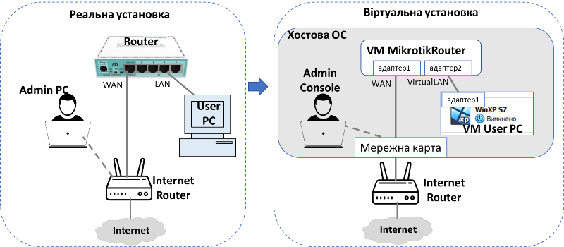

рис.3.1. Структура лабораторної установки

### Послідовність виконання роботи

- [ ] Отримайте номер варіанту у викладача. **Номер варіанту повинен бути відмінний від `1`!**

#### 1. Встановлення віртуальної машини для маршрутизатору Mikrotik

- [ ] Встановіть віртуальну машину ОС маршрутизатору Mikrotik [додатку 3.1](d3_1.md) 
- [ ] Запустіть віртуальну машину маршрутизатору та перевірте доступ до Веб-консолі 

**Надалі під словом "маршрутизатор" буде розумітися віртуальна машина з ОС маршрутизатору Mikrotik.** 

#### 2. Налаштування мережної карти LAN для маршрутизатору 

- [ ] У веб-консолі маршрутизатору автентифікуйте себе (користувач та пароль). Ви автоматично перейдете у вікно швидких налаштувань. 
- [ ] Зверніть увагу на наявність 2-х мережних карт, що називаються `Internet` та `Local Network` (рис.3.2). Для WAN за замовченням вказується автоматичний режим отримання адреси IP (`Automatic`), тому тут мережний інтерфейс як DHCP-клієнт отримав адресу `192.168.10.106` та `Gateway = 192.168.10.50` від DHCP-серверу в мережі. **У Вашому випадку це буде інша адреса, яку необхідно буде враховувати в майбутніх пунктах!**     
- [ ] Для `Local Network` введіть `IP Address = 192.168.x.1` (де `x` - номер варіанту) та виберіть маску  Після цього натисніть `Apply Configuration` (рис.3.2.)  

**Увага, надалі в прикладах буде використовуватися віртуальна локальна мережа `192.168.1.0` у вашому випадку буде мережа  `192.168.x.0` (де `x` - номер варіанту) !**


рис.3.2. Налаштування мережної карти LAN для маршрутизатору

#### 3. Перевірка доступу до маршрутизатору до Internet

- [ ] У вікні веб-консолі маршрутизатору перейдіть до відображення усіх налаштувань.


- [ ] Відкрийте вікно `Tools->Ping` та перевірте чи йдуть пінги до адреси в Інтернеті, наприклад `8.8.8.8`. Якщо пінги йдуть переходьте до інших пунктів лабораторної. Якщо ні - проконсультуйтеся з викладачем.


рис.3.3. Вікно утиліти `ping` на маршрутизаторі 

#### 4. Налаштування віртуальної машини користувача зі статичними адресами

- [ ] У VirtualBox Manager відкрийте налаштування віртуальної машини, яка використовувалася в минулій лабораторній роботі
- [ ]  Налаштуйте `Адаптер 1` на роботу з віртуальною мережею `VirtualLAN` , усі інші адаптери відключіть.


рис.3.4. Налаштування мережної карти віртуальної машини

- [ ] Запустіть вірутальну машину Windows XP
- [ ] Виставте статичну IP адресу на мережній карті:  
- `IP=192.168.1.10/24`
- `Default Gateway = 192.168.1.1`.
- `DNS = 8.8.8.8`


рис.3.5. Налаштування статичної IP-адреси для віртуальної машини

- [ ] З віртуальної машини зробіть пінгування маршрутизатору `ping 192.168.1.1`: має бути успішний
- [ ] З маршрутизатору зробіть пінгування віртуальної машини `ping 192.168.1.10`: має бути успішний

#### 5. Налаштування DHCP для видачі з пула адрес

У цьому пункті налаштовується DHCP Server для видачі IP-адрес з налаштовуваного пулу. У цьому випадку динамічні IP адреси будуть видаватися з 50 до 100 (але починаючи з 100-ї)

- [ ] У вікні веб-консолі маршрутизатору перейдіть до відображення спрощеного інтерфейсу.


- [ ] Активуйте налаштування DHCP та зробіть діапазон видачі портів `192.168.1.50-192.168.1.100`. Після цього натисніть `Apply Configuration`   

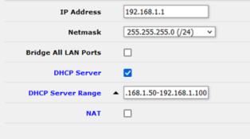

рис.3.6. Налаштування DHCP

- [ ] На віртуальній машині комп'ютера виставте для мережної кати отримання IP адреси автоматично. Через кілька секунд після підтвердження перевірте чи мережна карта отримала налаштування.   

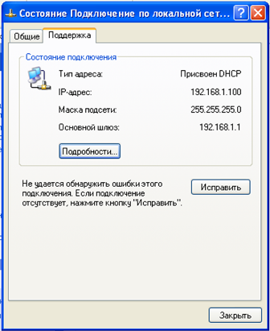

рис.3.7. Перегляд стану карти

- [ ] У вікні веб-консолі маршрутизатору перейдіть до відображення усіх налаштувань.


- [ ] Перейдіть в налаштування DHCP-Servers подивіться в списку `Leases` тимчасво видані IP адреси.  


рис.3.8. Список налаштованих та виданих IP адрес.  

Наведений вище список містить усі записи для видачі та виданих IP адрес.

- [ ] Зайдіть в запис кліком по ньому. Зробіть копію екрану для звіту.

#### 6. Налаштування DHCP для видачі за MAC адресою

У цьому пункті необхідно налаштувати DHCP-сервер, щоб він видавав конкретну адресу за вказаним MAC. У Mikrotik це можна зробити назначивши динамічний запис як статичний.

- [ ] Відкрийте запис виданої IP-адреси з  `Leases`. Натисніть кнопку `Make Static`. Тепер запис стає правилом.  
- [ ] Натисніть `Close`

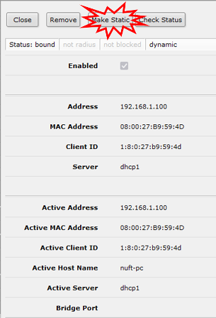

рис.3.9. Створення статичного запису в DHCP

- [ ] Знову відкрийте цей запис. Тепер зробіть певні зміни в налаштуваннях, що наведені нижче, після чого натисніть `Ok`:
- змініть останній байт IP-адреси на `21`
- видаліть `Client ID`, щоб правило діяло тільки на MAC-адресу 
- видаліть порожнє поле  `DHCP Option Set`, якщо воно активне (інакше підтвердження не буде працювати)  

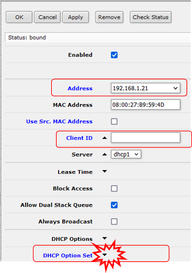

рис.3.10. Налаштування статичного запису в DHCP

- [ ] Перейдіть у вікно стану мережної карти віртуальної машини і натисніть "Виправити", щоб повторно драйвер запросив IP-адресу. Після цього у карти повинна з'явитися нова IP адреса.  

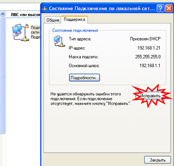

рис.3.11. Повторне отримання IP-адреси

#### 7. Перегляд деякої інформації на маршрутизаторі

У цьому пункті пропонується подивитися вікна з деякими корисним налаштуваннями. Усі інші налаштування не є предметом даної лабораторної роботи.

- [ ] У веб-консолі маршрутизатору перейдіть до режиму відображення усіх налаштувань, якщо це не так.
- [ ] Перейдіть до пункту меню `Interfaces`. На закладці `Interfaces` можна подивитися список та стан інтерфейсів а також налаштувати їх, клікнувши по конкретному інтерфейсу. У даній лабораторній роботі тут нічого змінювати не потрібно. 


рис.3.12. Список та стан інтерфейсів маршрутизатору 

- [ ] Перейдіть на пункт меню `IP->ARP`. Тут видно ARP таблицю.


рис.3.13. ARP таблиця маршуртизатору

- [ ] Перейдіть на пункт меню `IP->Addresses`. Тут видно список IP-адрес, які є у маршрутизатору.


рис.3.14. Список IP-адрес маршрутизатору

- [ ] Перейдіть на пункт меню `IP->DHCP-Client`. Тут видно список IP-адрес, які видані маршрутизатору як DHCP-клієнту на інтерфейсі `ether1` та їх статус.


рис.3.15. Стан DHCP-клієнту

- [ ] Перейдіть на пункт меню `IP->Routes `. Тут видно список маршрутів 

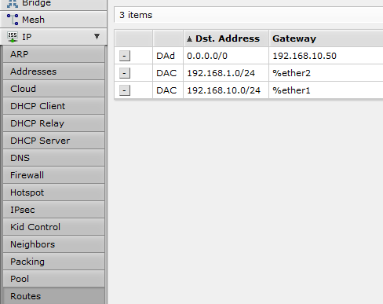

рис.3.16. Список маршрутів 

- [ ] Передивіться також наступні закладки `IP`:

- `DNS` - зокрема список DNS-серверів
- `Services` - список доступних сервісів на маршрутизаторі. Зверніть увагу на те, який сервіс деактивовано (`x`).

- [ ] Передивіться журнал `LOG`

#### 8. Визначення конфігурації мережі та маршрутних таблиць

- [ ] За доступними вікнами налаштування маршрутизатору та хостової ОС визначте конфігурацію IP-адрес мережі за прикладом на рис.3.17 та впишіть в таблицю нижче:

Таб.3.1. Конфігурація мережних інтерфейсів пристроїв

| Вузол             | Адаптер: назва                      | IP-адреса      | Мережа          | Default Gateway | Примітка                                  |
| ----------------- | ----------------------------------- | -------------- | --------------- | --------------- | ----------------------------------------- |
| VM MikrotikRouter | 1:ether1                            | 192.168.10.106 | 192.168.10.0/24 | 192.168.10.50   | мост до фізичного WiFi Адаптеру           |
| VM MikrotikRouter | 1:ether2                            | 192.168.1.1    | 192.168.1.0/24  | -               | віртуальна мережа                         |
| Admin Console     | 1:WiFiАдаптер                       | 192.168.10.103 | 192.168.10.0/24 | 192.168.10.50   | фізичний WiFi Адаптер, номер 15 (`if 15`) |
| VM User PC        | 1: Підключення по локальній мережі1 | 192.168.1.21   | 192.168.1.0/24  | 192.168.1.1     | віртуальна мережа                         |
| Internet Router   | 1:LAN                               | 192.168.10.50  | 192.168.10.0/24 | -               |                                           |
| Internet Router   | 2:WAN                               | -              | -               | -               | не має значення                           |

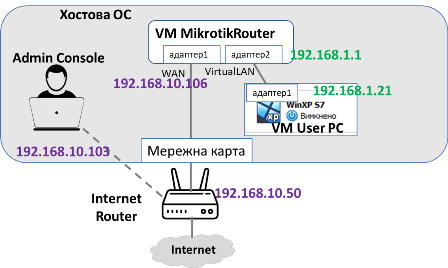

рис.3.17. Схема конфігурації мережі

- [ ] Виведіть таблицю маршрутизації для `VM MikrotikRouter` (див. попередній пункт, рис.3.16). Зробіть копію екрану.
- [ ] Виведіть таблицю маршрутизації для хостової ОС (див [ЛР2](2.md)). Зробіть копію екрану в частині IPv4.
- [ ] Виведіть таблицю маршрутизації для `VM User PC` (див ЛР2). Зробіть копію екрану.

#### 9.Налаштування маршрутизації

- [ ] Зробіть пінг з `Admin Console` на `VM User PC`, наприклад, згідно рис.3.17 це буде команда

```bash
ping 192.168.1.21
```

Пінг повинен бути невдалим, бо усі пакети що йдуть з `Admin Console` і не в мережі `192.168.10.0` перенаправляються маршрутизатору за замовченням, а той має адресу `192.168.10.50`. Це реальний маршрутизатор, і він не знає про існування мережі  `192.168.1.0` тому буде відправляти пакети на інший маршрутизатор за замовченням, який знаходиться поза наведеної структури на рисунку, що позначено як `Internet`. Щоб змінити цю поведінку, треба в `Admin Console`, по суті в хостовій ОС прописати новий маршрутний запис. 

- [ ] На хостовій ОС запустіть командний рядок в режимі адміністратора
- [ ] Виконайте команду, підставляючи свої значення (прочитайте для деталей "Добавлення маршрутизатору" підрозділу 6.6 з [лекції 6](../lec/6.md)): 

```bash
route add 192.168.1.0 mask 255.255.255.0 192.168.10.106 if 15
```

де:

-  `192.168.1.0 mask 255.255.255.0 `  - адреса мережі призначення   
-  `192.168.10.106` - адреса маршрутизатору, куди необхідно переадресовувати пакети 
- `15` (після `if`) - номер інтерфейсу (отримується з `route print`) 

- [ ] Зробіть пінг з `Admin Console` на `VM User PC`, тепер пінги повинні проходити.
- [ ] Зробіть пінг з `VM User PC` на `Admin Console`, тепер пінги повинні проходити. **Зверніть увагу, що пінги можуть бути заблоковані брандмауером хостової ОС!** 

- [ ] Використовуючи Packet Sender на хостовій та віртуальних машинах, перевірте відправку пакетів з хостової на віртуальну машину через TCP порт `5555`. 

#### 10. Налаштування NAT

У цьому пункті на маршрутизаторі встановиться NAT-сервер, який робить трансляцію IP-адрес з одного інтерфейсу мережі (за NAT-ом) в іншу. У нашому випадку NAT буде розгорнуто для LAN. Трансляція мережевих адрес (NAT, Network Address Translation) — це стандарт Інтернету, який дозволяє хостам у локальних мережах використовувати один набір IP-адрес для внутрішнього зв’язку та інший набір IP-адрес для зовнішнього зв’язку. Локальна мережа, яка використовує NAT, називається мережею за NAT-ом (`natted`). Для функціонування NAT у кожній мережі за NAT-ом має бути шлюз NAT. Шлюз NAT (маршрутизатор NAT) виконує перезапис IP-адреси під час переміщення пакета з/до локальної мережі. Деталі про організацію NAT читайте в лекції. 

- [ ] На віртуальній машині `VM User PC` зробіть пінгування `8.8.8.8` 

```bash
ping 8.8.8.8
```

Пінги не повинні пройти оскільки `Internet Router` не знає про мережу `192.168.1.0` і не зможе відповідати на відповідні запити. Одним з виходом з цієї ситуації є налаштування таблиць маршрутизації на `Internet Router`, подібно до того, як це було зроблено в попередньому пункті. Натомість на маршрутизаторі Mikrotik ми використаємо NAT-трансляцію. Так як `Internet Router` знає про мережу `192.168.10.0` (бо вона безпосередньо підключена до нього), при NAT-трансляції усі вихідні пакети з  `Internet Router`  будуть йти від імені адреси `192.168.10.106`.    

- [ ] У вікні веб-консолі маршрутизатору перейдіть до відображення спрощеного інтерфейсу.


- [ ] Для локальної мережі активуйте опцію використання серверу `NAT` і натисніть `Apply Configuration`

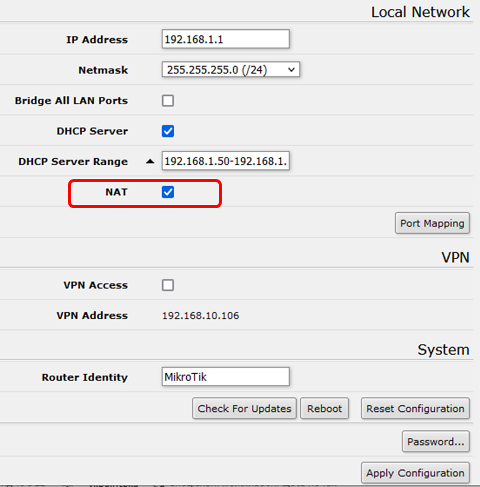

рис.3.18. Активація NAT-серверу

- [ ] На віртуальній машині `VM User PC` зробіть пінгування `8.8.8.8`. Тепер пінги повинні проходити вдало.
- [ ] Зайдіть в `IP->Firewall->NAT`, в списку буде створене правило. 

#### 11. Налаштування правил фільтрування пакетів

У даному пункті необхідно захистити локальну мережу від зовнішнього доступу. NAT зробив невидиму внутрішню мережу (тобто за NAT-ом) для всіх вихідних пакетів з WAN, тому що в адресі відправника буде IP-адреса WAN. У той же час маршрутизація працює, тому якщо з зовнішньої мережі прийде пакет на WAN порт, то цей пакет згідно правил маршрутизації (в таблицях) може перенаправитися у внутрішню мережу, що може бути небезпечно. У більшості маршрутизаторів є вбудований брандмауер (firewall), в якому можна налаштувати правила фільтрації трафіку як вхідного так і вихідного. Вікна та спосіб налаштування цих правил сильно залежить від реалізації маршрутизатору, тому тут увага буде приділятися не синтаксису а радше прикладу.

Брандмауер (firewall) працює за допомогою правил брандмауера. Кожне правило складається з двох частин: 

- відповідника, який зіставляє потік трафіку з заданими умовами, 
- дії (**action**), яка визначає, що робити з відповідним пакетом.

Правила фільтрації брандмауера згруповані в ланцюжки (**chains**). Це дозволяє зіставляти пакет за одним загальним критерієм в одному ланцюжку, а потім передавати його для обробки за деякими іншими загальними критеріями до іншого ланцюга. Наприклад, пакет має бути зіставлений із парою `IP-адреса:порт`. Звичайно, цього можна досягти, додавши стільки правил із збігом `IP-адреса:порт` до ланцюга `forward`, скільки потрібно, але кращим способом може бути додавання одного правила, яке відповідає трафіку з певної IP-адреси, наприклад:

```bash
/ip firewall filter add src-address=1.1.1.2/32 jump-target="mychain"
```

 і в разі успішного збігу передає контроль над IP-пакетом іншому ланцюжку, у цьому прикладі це `mychain`. Тоді правила, які виконують зіставлення з окремими портами, можна додати до ланцюжка `mychain` без вказівки IP-адрес.

Є три попередньо означені ланцюжки, які неможливо видалити:

-  **input** - використовується для обробки пакетів, які надходять на маршрутизатор через один із інтерфейсів з IP-адресою призначення, яка є однією з адрес маршрутизатора. Пакети, що проходять через маршрутизатор, не обробляються проти правил вхідного ланцюжка.
-  **forward** - використовується для обробки пакетів, що проходять через маршрутизатор
-  **output** - використовується для обробки пакетів, що виходять з маршрутизатора та залишають його через один із інтерфейсів. Пакети, що проходять через маршрутизатор, не обробляються всупереч правилам вихідного ланцюжка     

Також є ланцюкжи, означені для NAT

- **srcnat** (вихідний NAT) - використовується для пакетів, які надходять з мережі за NAT-ом. Маршрутизатор NAT замінює приватну адресу джерела IP-пакету новою загальнодоступною IP-адресою під час проходження через маршрутизатор. Зворотна операція застосовується до пакетів відповіді, що рухаються в іншому напрямку.
- **dstnat** (destination NAT) - цей тип NAT виконується для пакетів, які призначені для мережі за NAT-ом. Він найчастіше використовується, щоб зробити хости в приватній мережі доступними з Інтернету. NAT-маршрутизатор, що виконує dstnat, замінює IP-адресу призначення IP-пакету під час його проходження через маршрутизатор до приватної мережі.

- [ ] Зайдіть в `IP->Firewall->Filter Rules`, добавте нове правило в якому вкажіть:

- `Chain = forward`
- `In. Interface  = ether1`
- `Out. Interface = ether2` 
- `Action = reject`
- `Connection NAT State = ! Srcnat` (зверніть увагу на знак `!` що значить інверсію)

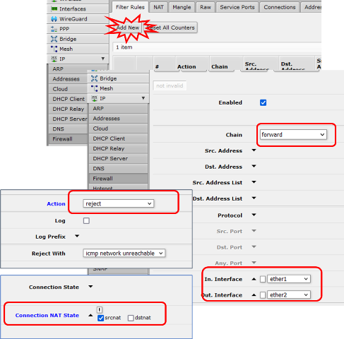

рис.3.19. Налаштування правила фільтрування пакетів

- [ ] Натисніть `Ok`.

Це правило відкидає усі вхідні пакети з WAN які перенаправляються в LAN, за винятком тих, які проходять із-за NAT-у в якості відповіді. 

- [ ] Зробіть пінгування  з `Admin Console` на `VM User PC` пінг повинен бути невдалим з результатом:

```
 Destination net unreachable
```

Саме ця причина вказана в полі `Reject with` на рис.

- [ ] Зробіть пінгування з `VM User PC`  адреси `8.8.8.8` , пінг повинен проходити.
- [ ] Використовуючи Packet Sender на хостовій та віртуальних машинах, перевірте відправку пакетів з хостової на віртуальну машину через порт `5555`. Пакети не повинні проходити.

#### 12. Налаштування правил прокидування портів

У цьому пункті розглянемо налаштування прокидування порту до застосунку на вузлі за NAT-ом. У попередньому пункті Packet Sender з хостової машини не може підключитися до віртуальної, бо доступ до нього закритий брандмауером. У таких випадках можна зробити виключення в налаштуваннях, щоб деякі пакети проходили через маршрутизатор. Однак задача не може бути вирішена подібним чином, якщо підмережі LAN та WAN не можна маршрутизувати. У цьому випадку WAN-інтерфейс може перенаправляти пакети що направлені на його інтерфейс.

- [ ] У вікні веб-консолі маршрутизатору перейдіть до відображення спрощеного інтерфейсу. 
- [ ] Зайдіть в налаштування Port Mapping. Добавте правило прокидування з назвою 5555:

- `protocol = tcp`
- `To Address = 192.168.1.21`
- `To Port = 5555`

 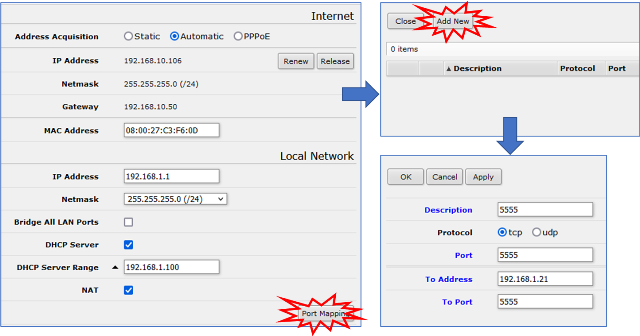

рис.3.20. Налаштування правила прокидування портів

- [ ] Натисніть `Ok`.

Це правило буде перенаправляти усі вхідні з'єднання на tcp-порт `5555` інтерфейсу `192.168.10.106` на такий же порт `192.168.1.21` . 

Однак налаштоване зверху правило фільтрації не пустить пакети далі інтерфейсу `192.168.10.106`. Тому його треба модифікувати.

- [ ] Зайдіть в `IP->Firewall->Filter Rules`, модифікуйте існуюче правило в якому додатково вкажіть що правило не стосується `dstnat`


рис.3.21. Зміна правила

- [ ] Збережіть правило. 
- [ ] Використовуючи Packet Sender на хостовій та віртуальних машинах, перевірте відправку пакетів з хостової на віртуальну машину через порт `5555` та IP адресу WAN-порта хостової машини. Пакети не повинні проходити.

#### 13. Доступ до реального маршрутизатору

Цей пункт не є обов'язковим для виконання і виконується якщо у Вас є реальний маршрутизатор, до якого Ви маєте доступ. 

**Увага! Зміни у реальному обладнанні можуть привести до його непрацездатності та шкоді! Ви виконуєте цей пункт на свій страх та ризик!**  

- [ ] Прочитайте інструкцію користувача до Вашого маршрутизатору.   

- [ ] Дізнайтеся адресу IP вашого маршрутизатору, наприклад через перевірку виданих Вашому комп'ютеру адрес IP. 

- [ ] Спробуйте зайти на Веб-консоль за визначеним IP. Якщо Веб-консоль не відкривається, то можливо Ваш маршрутизатор не підтримує цю функцію, або вона відключена на порті, до якого Ви підключені. Якщо вдалося підключитися перейдіть до наступних пунктів.

- [ ] Пройдіть автентифікацію.

- [ ] Спробуйте за допомогою вбудованих вікон:

-  подивитися налаштування усіх мережних інтерфейсів

- зробити пінг на якусь адресу в Інтернеті

- зробити пінг Вашого пристрою в локальній мережі

- подивитися список підключених пристроїв

- подивитися де прописуються правила фільтрування пакетів

  
