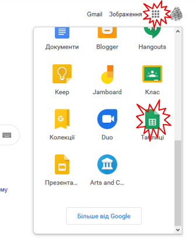
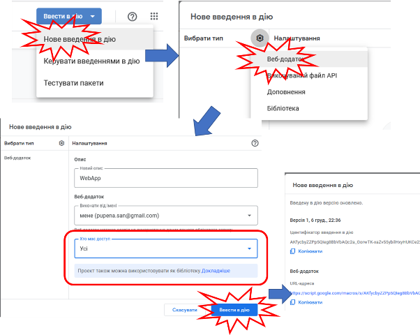
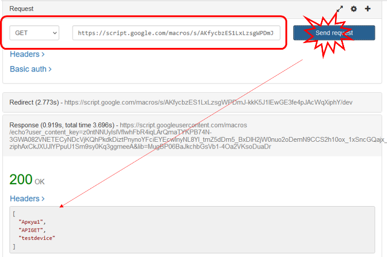

[Лабораторні](README.md)

# ЛАБОРАТОРНА РОБОТА № 4. Створення розподіленого застосунку

**Тривалість**: 4 акад. години (2 пари).

**Мета:** Навчитися створювати розподілені застосунки на базі REST API з використанням різноманітних пристроїв 

### Лабораторна установка

**Необхідне апаратне забезпечення.** 

Для проведення лабораторних робіт необхідно мати комп’ютер з наступною мінімальною апаратною конфігурацією:

- CPU Intel/AMD 1 ГГц / RAM 2 ГБ / HDD 10 ГБ (вільних)
- смартфон або планшет з ОС Андроїд  

**Необхідне програмне забезпечення.** 

- На комп’ютері повинна бути встановлена одна з операційних систем, підтримуваних віртуальною машиною VirtualBox та налаштована відповідно до вимог минулої лабораторної роботи. 
- Повинен бути встановлений  VirtualBox
- Повинна бути встановлена віртуальна машина з Mikrotik з минулих лабораторних робіт 
- інше програмне забезпечення встановлюється по ходу виконання лабораторних робіт 

**Загальна постановка задачі**. 

Цілі роботи: 

1) навчитися створювати розподілені застосунки на базі REST API
2) навчитися використовувати Google Apps Scripts для створення WEB-застосунків
3) навчитися використовувати утиліти тестування HTTP API

Лабораторна робота розроблена з урахуванням самостійного виконання без наявності реального обладнання окрім ПК та смартфону. 

### Послідовність виконання роботи

#### 1. Створення документу Google Sheet з розширенням Google Apps Scripts (GAS)

`Google Sheet` - це хмарний застосунок від Google для роботи з електронними таблицями. За функціональністю і принципами роботи він схожий на `Microsoft Excel`. Усі створені таблиці зберігаються на Гугл Диску (`Google Drive`). У даному рішенні електронна таблиця буде виконувати роль простої бази даних куди буде накопичуватися різноманітна інформація з різних пристроїв. Взаємодія з базою даних відбуватиметься через розгорнутий Web Applications на базі сервісів Google Apps Scripts, надалі вживатиметься термін  **GAS**. У цьому пункті необхідно:

- створити таблицю Google Sheet
- створити розширення на Google Apps Scripts
- реалізувати функцію в GAS, яка буде записувати значення у вказані комірки вказаного листа з фіксацією часу   

- [ ] Якщо у Вас немає облікового запису Google - створіть його [на сайті](https://www.google.com/). Це безкоштовно, потребується тільки поштова скринька і номер телефону. 

- [ ] Зайдіть на головну сторінку [Google](https://www.google.com/) і зайдіть в застосунок `Google Sheet`(`Таблиці`)



рис.4.1. Створення таблиці Google Sheet

Альтернативно можна відразу перейти [на сторінку](https://docs.google.com/spreadsheets)  

- [ ] У новому вікні натисніть кнопку "+" (створити) щоб створити нову електронну таблицю

- [ ] Змініть назву документу на якусь більш прийнятну, наприклад `WebAppLaba4`

- [ ] Створіть розширення на Apps Script


рис.4.2. Створення розширення на Apps Script

- [ ] Новостворений проект перейменуйте у `WebAppYourName`, де `YourName` ваше ім'я та прізвище

#### 2. Створення функції Google Apps Scripts для запису полів у вказаний лист 

- [ ] Проаналізуйте та впишіть наступний код

```js
//тестовий запис
let smplrecord = {
  device: 'testdevice',
  field1: Math.random(),
  field2: 'this is a text',
  field3: {text: 'this is JSON', n: Math.random()*100.0}
}
//тестування виклику
let result = LogToSheet (smplrecord);
console.log (result);

function LogToSheet (record) {
  if (!record) return 
  let devicename = record.device;
  // якщо імя пристрою не вказане, завершити виконання функції і
  // і повернути відповідний текст 
  if (typeof devicename !== 'string') {
    return 'There is no device field';
  } 
  
  // доступ до активного документу Google Sheet
  let ss = SpreadsheetApp.getActive();
  // доступ до листа - журналу пристрою  
  let sheet = ss.getSheetByName(devicename);
  // якщо такого листа немає - створити
  if (!sheet) {
    sheet = ss.insertSheet(devicename);
  }
  // спочатку вставляємо новий запис в 2-гу позицію
  // усі старі записи зміщуються вниз
  sheet.insertRowBefore(2);
  // доступаємося до перших 2-х клітин в 1-му рядку
  let r = sheet.getRange (1,1,1,2);
  // пишемо назви колонок
  r.setValues ([['TS','DT']]);
  // доступаємося до перших 2-х клітин в 2-му рядку  
  r = sheet.getRange (2,1,1,2);
  // пишемо TS - відмітку часу, DT - дату та часу
  let date = new Date();
  r.setValues ([[date.valueOf() , date.toLocaleDateString('uk-UA') + ' ' + date.toLocaleTimeString('uk-UA')]])
  i=3; // починаємо з 3-го стовпчика
  // перебираємо усі поля
  for (let propname in record){
    // device використовується для назив листа
    if (propname !='device') {
      // виділяємо область i-ї ствопця, 1 та 2 рядки
      r = sheet.getRange(1,i,2,1);
      // у 1-му рядку - назва, у 2-му - значення 
      r.setValues ([[propname],[record[propname]]])
      i++;
    } 
  }
  return (i-3 + ' parameters are recorded')
}
```

- [ ] Збережіть та запустіть на виконання. Перший раз повинно з'явитися повідомлення про необхідність надання доступу застосунку до Google Sheet. Автентифікуйте себе, та надайте дозвіл на доступ.   


рис.4.3. Дозвіл на доступ застосунку до Google Sheet

- [ ]  Після успішного виконання у вікні консолі повинно з'явитися повідомлення: 

  ```
  `Інформація 3 parameters are recorded`
  ```

- [ ] Перевірте в документі Google Sheet створилася вкладка `testdevice` з відповідним записом.


рис.4.4. Відображення запису 

- [ ] Запустіть ще кілька раз скрипт, щоб створилося кілька записів в баблиці.

#### 3. Створення та перше розгортання Web Application на базі GAS 

У даному пункті необхідно реалізувати HTTP API інтерфейс для доступу до даних для читання. Читання даних передбачатиме доступ до записів в конкретних листів, відповідного `device` з використанням методу GET за шаблоном:

```http
GET baseurl/device
```

Де `baseurl`  - базова частина URL-шляху, яка вказується Google при публікації або тестуванні інетрфейсу  Якщо `device` не вказується, тобто:

```http
GET baseurl
```

то виклик методу повинен повинен повертати перелік листів. В обидвох випадках дані повинні повертатися   у форматі JSON. 

У даній частині лабораторної роботи не проводиметься захист даних і не вимагатиметься автентифікація при доступі до інтерфейсу, а доступ до даних в Google Sheet відбуватиметься через автентифікацію від імені власника застосунку.  

- [ ] Допишіть функцію `doGet(e)` яка повертає зміст вказаного листа або перелік листів, якщо лист не заданий.  

```js
// доступ до даних
function doGet(e) {
  // все що йде після базової частини URL, 
  // тобто праворуч від /dev або /exec
  let path = e.pathInfo;
  // запис для журналу для налагодження
  let record = {device : "APIGET", path: path};
  LogToSheet (record); // закоментувати за відсутності налагодження
  let ss = SpreadsheetApp.getActive();  
  let sheets = ss.getSheets();
  let retob = ['Not Found']; // якщо щось пішло не так
  if (typeof path == 'string') { // якщо параметр є 
    try { // ловимо помилку
      // доступ до вказаного листа 
      let sheet = ss.getSheetByName(path);
      // отримати всі  дані
      retob = sheet.getDataRange().getValues();
    } catch (error) { // якщо зловили помилку
      retob = [error + ' ' + path];
    }
  } else { // якщо без параметрів, тільки базоий URL
    try {
      retob = []; // масив з переліком назв листів
      for (let sheet of sheets){ //перебираємо листи
        retob.push (sheet.getName()) //добавляємо назви в масив 
     }
    } catch (error) {
      retob = [error + ' ' + path];
    }
  }
  // формуємо вихід як JSON 
  return ContentService.createTextOutput(JSON.stringify(retob)).setMimeType(ContentService.MimeType.JSON);
}
```

- [ ] Збережіть проект
- [ ] Опублікуйте скрипт як Веб-застосунок (рис.4.5). 

 

рис.4.5. Публікація скрипту як Веб-застосунку 

Після публікації застосунку його базовий URL матиме вигляд:

```http
https://script.google.com/macros/s/AKfyVOWxGcR9A/exec
```

Зауважте що кожна зміна коду буде приводити до необхідності публікації нового застосунку. Стара адреса буде використовуватися зі старим кодом. Так забезпечується версійність, коли старі застосунки залишаються робочими при зміні реалізації.

Також варто відзначити, що Google Apps Scripts пропонує два інтерфейси:

- для виконання, URL якого завершується `/exec` і постійно змінюється при публікації
- для налагодження, URL якого завершується `/dev` і не змінюється при публікації, є постійною що спрощує налагодження але доступний тільки розробникам. Приклад такого URL:  

```http
https://script.google.com/macros/s/AKfycbzES1LxLzsgWPDm/dev
```

Таким чином налагоджувати веб-застосунок простіше з URL, що завершується на  `/dev`

#### 4. Тестування Web Application з використанням тестової утиліти

Для тестування API можна скористатися різними безкоштовними утилітами. У даній лабораторній роботі пропонується скористатися доповненням до браузерів `FireFox`  або `Chrome` з назвою  RESTED.

- [ ] Встановіть розширення для браузера RESTED, або аналогічне, яке можна знайти за посиланнями:

- https://addons.mozilla.org/en-US/firefox/addon/rested/
- https://chrome.google.com/webstore/detail/rested/eelcnbccaccipfolokglfhhmapdchbfg

- [ ] Скопіюйте в буфер URL для тестування (закінчується на `\dev`). Вставте в якийсь текстовий файл.


рис.4.6. Отримання посилання на інтерфейс режиму розроблення

- [ ] Запустіть розширення RESTED, як правило іконка на панелі інструментів браузера 

- [ ] У полі URL впишіть скопійовану адресу і натисніть `Send Request`



рис.4.7. Перевірка роботи запиту GET для доступу до переліку листів.

У відповіді повинен прийти список, або повідомлення про помилку.

- [ ] Подивіться Google Sheet. Там повинна з'явитися лист `APIGET` з даними по запитам. 

Увага! Лист `APIGET` призначений в даному розроблювальному застосунку тільки для тестування, варто закоментувати частину коду з викликом запису в даний лист, якщо налагодження не потребується, щоб не збільшувати даремно об'єм файлу.   

- [ ] Передивіться журнал виконання, в якому містяться результати виконання, повідомлення та помилки. 


рис.4.8. Перегляд журналу виконання

- [ ] Повторіть запит з вказівкою назви листа, тобто в кінці URL вкажіть назву листа через косу, наприклад `/testdevice`, щоб URL закінчувався на: 

```http
.../dev/testdevice
```

- [ ] У відповідь повинен прийти зміст листа в форматі JSON. 
- [ ] У RESTED збережіть запит в колекцію (кнопка `+`)

#### 5. Реалізація та перевірка методу POST для запису

У даному пункті необхідно реалізувати HTTP API інтерфейс для доступу до даних для запису. Запис даних передбачатиме відправку методу POST на базовий URL тобто за шаблоном:

```http
POST baseurl
```

у якому в якості корисного навантаження передаються дані в форматі JSON в форматі:

```json
{"device": "devicename", "field1": "fieldvalue1", ... "fieldn": "fieldvaluen"}
```

де:

- `devicename` - ідентифікатор пристрою, для якого буде створена окрема вкладка
- `field1` .. `fieldn` - назва параметрів, для яких відбуватиметься запис
- `fieldvalue1` .. `fieldvaluen` - значення параметрів, для яких відбуватиметься запис

- [ ] Проаналізуйте та допишіть в програму шматок коду, що реалізує обробник методу POST: 

```js
// запис даних
function doPost(e) {
 // корисне навантаження 
 let contents = e.postData.contents;
 let retob = {contents: contents};
  try {
    // перетворюємо на об'єкт
    let payload = JSON.parse(contents);
    // якщо є властивість device
    if (payload.device) {
      LogToSheet (payload);
      retob.msg = 'logged succefull'
    } else {
      retob.error = 'device field not found'
    }
  } catch (error) {
    retob.error = error;
  }
 return ContentService.createTextOutput(JSON.stringify(retob)).setMimeType(ContentService.MimeType.JSON);
}
```

- [ ] Збережіть проект
- [ ] Використовуючи RESTED перевірте роботу інтерфейсу
  - виберіть метод POST
  - у якості URL використайте базовий адрес, що зкінчується на `/dev`
  - тип корисного навантаження виберіть JSON 
  - добавте поля: `device` зі значенням `testdevice` та кілька інших полів зі значеннями
  - натисніть `Send requestі перевірте, що:
    - відповідь прийшла позитивна
    - запис добавився на лист `testdevice` у Google Sheet


рис.4.9. Перегляд методу POST за допомогою RESTED 

- [ ] Збережіть запит в колекцію

#### 6. Перевірка роботи через опублікований API

У попередніх пунктах використовувався API режиму розробника, URL якого не змінюється під час зміни проекту та новій публікації. У цьому пункті необхідно протестувати API режиму виконання, URL якого змінюється при кожній публікації нового серверу.    

- [ ] Опублікуйте змінений застосунок, при публікації скопіюйте URL-адесу. 


рис.4.10. Публікація нової версії застосунку

Цю адресу можна також буде знайти у будь який момент часу у пункті "Керування введенням в дію"

- [ ] Протестуйте роботу методів GET і POST з скопійованим URL. 

#### 7. Перевірка роботи клієнта Web Application через curl

cURL — назва проєкту і крос-платформового програмного засобу, що служить для передачі даних через HTTP. Його можна використовувати як для тестування так і для реалізації обміну по HTTP через командний рядок.

У даному пункті cURL буде використовуватися як тестова утиліта. Але так само її можна запускати на різноманітних пристроях з ОС, наприклад для запису якихось значень з планувальника.

- [ ] Завантажте cURL для Вашої ОС https://curl.se/download.html   
- [ ] Розархівуйте папку у зручне для Вас місце, наприклад `C:/temp`
- [ ] Запустіть командний рядок. Перейдіть у папку bin розархівованої папки. Для Windows це матиме приблизно такий вигляд:

```shell
cd C:\temp\curl-7.86.0_2-win64-mingw\bin
```

- [ ] Виведіть довідку по cURL :

```shell
curl -h
```

- [ ] Перевірте роботу методу GET наступним чином, де вставте URL вашого API режиму виконання:

```shell
curl -L https://script.google.com/macros/s/AKfycbyPDQrLEi20cmHw/exec
```

- [ ] Перевірте отриманий результат.

Опція `-L`  потрібна для того, щоб у випадку коли сервер повідомляє, що запитану сторінку переміщено в інше місце (позначене заголовком `Location`: і кодом відповіді `3XX`), ця опція змусить curl повторити запит у новому місці ([деталі](https://curl.se/docs/manpage.html#-L)). Google Apps Script працює саме через перенаправлення заради безпеки, тому ця опція потрібна. 

- [ ] Перевірте роботу методу POSTнаступним чином, де вставте URL вашого API режиму виконання:

```bash
curl -L https://script.google.com/macros/s/AKfycbyPDQrLEiQjV8YCLplk2FENdnEWssuQK0AVuhLkP8VckZXmJyyml5EtDBHynACJ20cmHw/exec -H "Content-Type:application/json" -d "{\"device\":\"testdevice\", \"field1\":\"1\", \"field2\":\"2\", \"field3\":\"3\"}"
```

- [ ] Перевірте отриманий результат і що запис був записаний у лист Google Sheet.

У наведеному прикладі використовувалися опції:

- `-H` для вказівки заголовку
- `-d` для вказівки даних що передаються, що автоматично переключає утиліту в режим використання методу POST

Крім того, враховуючи щ в JSON форматі використовуються дужки, необхідно їх дзеркалювати зворотною косою `\`, щоб вони не були прийняті як частина синтаксису команди `curl `   

#### 8. Відправки даних з Mikrotik

У даному пункті необхідно реалізувати HTTP клієнта на маршрутизаторі Mikrotik, вірніше на віртуальній машині з ОС Mikrotik, який буде періодично відправляти повідомлення з вказівкою часу з моменту включення.

Для цього використовуються вбудовані в маршрутизатор скрипти на мові `RouterOS`  ([повний опис](https://wiki.mikrotik.com/wiki/Manual:Scripting)), які викликатимуться по певним подіям планувальника ([повний опис](https://wiki.mikrotik.com/wiki/Manual:System/Scheduler)).У межах цієї лабораторної роботи не будемо заглиблюватися в деталі реалізації, зупинимося лише на основних моментах.

Для обміну по HTTP в  `RouterOS` використовується схожа за функціоналом до cURL вбудована утиліта `Fetch` . Це один із інструментів консолі в Mikrotik RouterOS, який як правило використовується для копіювання файлів на/з мережевого пристрою через HTTP/HTTPs, FTP або SFTP, але його також можна використовувати для надсилання запитів POST/GET і надсилання будь-яких даних на віддалений сервер 

- [ ] Запустіть віртуальну машину `Mikrotik RouterOS`
- [ ] Залогуйтеся у консольному вікні віртуальної машини
- [ ] Наберіть команду `ip address print` щоб дізнатися IP адресу віртуальної машини маршрутизатору
- [ ] За вказаною адресою зайдіть на веб-консоль маршрутизатору і залогуйтеся
- [ ] Перейдіть на закладку `WebFig` далі в розділ `System->Scripts`
- [ ] Створіть новий скрипт з іменем `periodic`, наведений нижче, замінивши URL, на відповідний з вашого API 

```bash
# send periodic message
:local upTime1 [/system resource get uptime];
:global URL "https://script.google.com/macros/s/0AVuhLkP8VckZXmJyyml5EtDBHynACJ20cmHw/exec"
:global httpdata1 ("{\"device\":\"router\", \"uptime\":\"" . $upTime1 . "\"}");
/tool fetch \
	http-method=post \
	http-header-field="Content-Type: application/json" \
	http-data=$httpdata1  \
	url=$URL
```

- [ ] Натисніть `Apply` після чого `Run Script`. Зачекайте кілька секунд і у Gogle Sheet повинен з'явитися лист з відповідним записом. 
- [ ] Натисніть `Ok`


рис.4.11. Створення скрипта для запису часу роботи на WEB застосунок

Прокоментуємо скрипт написаний вище

`:local`  і `:global` - це інструкції для створення глобальних та локальних змінних. Так створюються наступні змінні.

- Змінна `upTime1` якій при створенні назначається значення з системної властивості `/system resource get uptime` (її значення можна подивитися на відповідній вкладці веб-консолі). За необхідності можна записувати аналогічним чином будь яку доступну властивість на маршрутизаторі. 
- Змінній `URL` назначається значення рядку що відповідає за URL.
- Змінній `httpdata1` назначається значення корисного навантаження. Зверніть увагу, що тут також використовується екранування
- команда `/tool fetch` викликає утиліту `fetch` до якої передаються параметри:
  - `http-method` - метод
  - `http-header-field` - заголовки
  - `http-data` - тіло (корисне навантаження)
  - `url`

- [ ] У веб-консолі Mikrotik перейдіть на закладку `System->Scheduler`. Натисніть `Add New`.  
- [ ] Створіть задачу яка буде запускати скрипт з іменем `periodic` кожні 5 хвилин. І натисніть `Ok` 


рис.4.12. Налаштування планувальника.

- [ ] Через 5 хвилин проконтролюйте, що створився новий запис в таблиці Google Sheet.

Таким чином можна віддалено контролювати працездатність маршрутизатора, його доступ до інтернету та оцінювати час його перезавантаження.

#### 9. Відправки даних з Android

У даному пункті у якості клієнта використовується мобільний застосунок, який за потребою користувача відправляє географічні координати та текстову примітку, яку він вводить. Таким чином, користувач може фіксувати певну інформацію вдповідно до локації, де він знаходиться.

Даний пункт передбачає використання смартфона під ОС Android з включеною геолокацією. Якщо у здобувача немає такої можливості, пункт можна не виконувати.

- [ ] Встановіть на свій смартфон застосунок [HTTP Shortcuts](https://http-shortcuts.rmy.ch/) 
- [ ] Запустіть застосунок. 
- [ ] Створіть дві глобальні змінні (доступні для всіх ярликів) типу `Static Variable`, в яких вкажіть тільки назву:
- `geolacation`
- `note`


рис.4.13. Створення змінних

- [ ]  Створіть новий Shortcut: натисніть `+` для добавлення, для якого (рис.4.14):

- у виборі натисніть `Regular Shorcuts`. 
- надайте ім'я та виберіть піктограму.  

- у `Basic request settiings` вкажіть метод POST, а в рядок заголовку потрібний URL, який можна передати на смартфон наприклад через Telegram (пункт "Збережене")

- у `request body` виберіть тип `application/json` та означте структуру тіла, в якому в якості імені пристрою передається `myphone`, у властивості `location` передається значення `geolocation`, а у властивості `note` значення змінної `note` (**зверніть увагу на лапки!**); для вставлення змінних використовується кнопка `{}`
- у полі `scripting` для `Run Before Execution` (виконується перед запуском HTTP запиту) записати скрипт який буде записувати у значення змінних:
  - `geolocation` значення функції `getGeolocation`, яка повертає плинну позицію телефону
  - `note` результат виклику діалогової функції, яка попросить оператора ввести нотатку


рис.4.14. Створення Shortcut

- [ ] Збережіть Shortcut натиснувши галочку.
- [ ] Запустіть на виконання, натиснувши по назві. Введіть користувацький текст на запрошення.
- [ ] Перевірте чи результат прийшов без помилок. 
- [ ] Перевірте, що відповідний запис з'явився в листі Google Sheet `myphone`. 


## Наступна частина ще не готова. Чекайте, згодом буде!

#### 10. Взаємодія з Telegram


#### 11. Візуалізація бази через Google Sites

