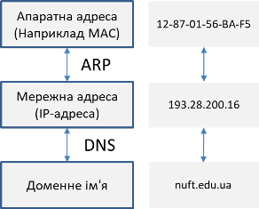
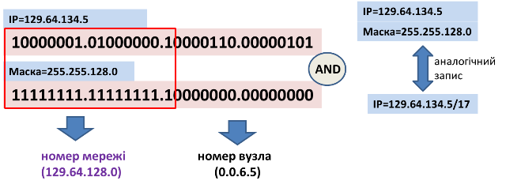
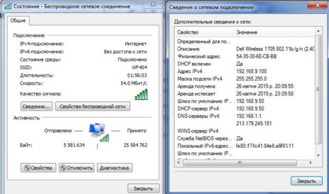
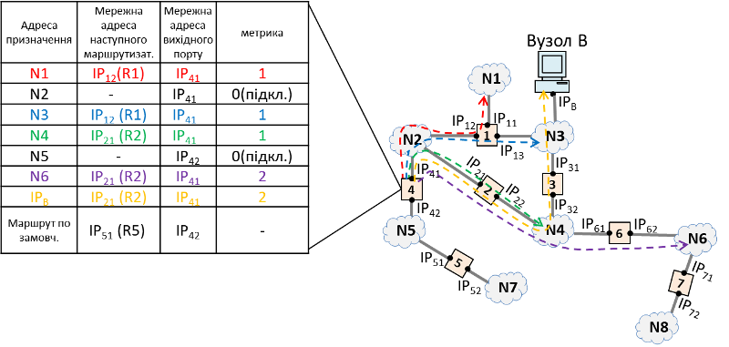
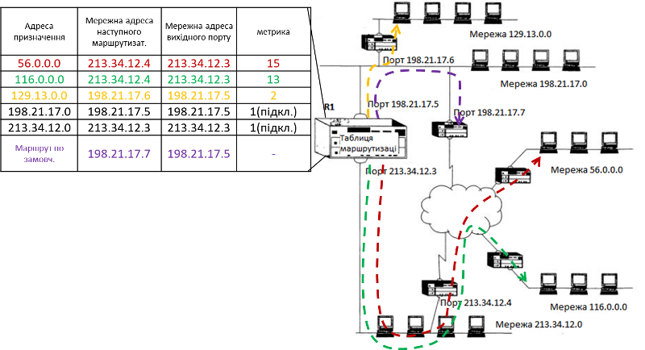

# 6. Протоколи рівня IP

## 6.1. Стек TCP/IP

### Про стек TCP/IP

Стек TCP/IP – це ієрархічно організований набір мережних протоколів, що використовуються в Інтернеті та комп'ютерних мережах; функціонують взаємопов'язано для виконання типових задач. Він включає такі рівні протоколів:

- прикладний - реалізація типових задач, зокрема:
  - FTP – пересилання файлів, 
  - HTTP – доступ до серверів, 
  - Telnet – для доступу терміналу, 
  - SMTP – робота з поштою
  - інші
- транспортний – реалізація доставки даних прикладним процесам: 
  - TCP – надійна доставка зі встановленням з'єднання, 
  - UDP – швидка без з'єднання але ненадійна (по можливості)
- міжмережний – реалізація доставки між вузлами в об'єднаних мережах: 
  - IP – доставка, 
  - всі інші для обслуговування роботи IP (ICMP, RIP, OSPF та інші)

Рівень доступу до мережі (канальний + фізичний) в даному стеці не регламентується і є тою частиною що забезпечує передачу даних від "хоста" до хоста або маршрутизатора.


рис.6.1. Модель TCP/IP в порівнянні з моделлю ISO OSI

Розглянемо як функціонує даний стек. Потік даних від прикладного рівня йде на транспортний рівень для відправки за призначенням. Потік ділиться на кілька пакетів або один, які можуть відправлятися одним з 2-х варіантів:

- надійному але повільному сервісу (TCP сегменти) 
- ненадійному але швидкому (UDP дейтаграми) використовуючи IP

Далі IP пакети відправляються до найближчого маршрутизатору, використовуючи кадри мережних інтерфейсів. Для цього відбувається упаковка в кадр і трансляція IP в апаратну адресу (MAC)  


рис.6.2. Послідовність інкапсуляції пакетів та їх передача.

### Типи сервісів

У даному стеку пропонуються різні типи сервісів відносно з'єднання:

- зі встановленням з'єднання (логічне з'єднання, віртуальний канал)

- без встановлення з'єднання 

Сервіси що орієнтовні на з'єднання передбачають попередню домовленість між учасниками зв'язку, в межах якої буде контролюватися весь обмін. Це може передбачати попереднє означення довжин пакетів, нумерування пакетів при передачі в межах з'єднання та інші дії. Якщо сервіс не передбачає з'єднання, то обмін відбувається без додаткових попередніх домовленостей.   

Відносно підтвердження доставки пакетів:

- з підтвердженням (квітуванням), надійні

- без підтвердження, ненадійні 

Пакети що не потребують підтвердження називаються **datagram** (**дейтаграми**).  Відправник дейтаграми в межах сервісу не буде знати результат її доставлення отримувачу. Прикладом такого сервісу є обмін в протоколі IP та UDP.

Якщо необхідно контролювати доставку пакету використовують сервіс з підтвердженням. У цьому випадку, отримувач повідомляє відправнику, чи отримав він пакет і чи цей пакет є коректним. Прикладом є TCP.  

### Протоколи мережного рівня

Хоч стек називається TCP/IP, для функціонування мережного рівня використовуються кілька протоколів, а не тільки IP. Це зумовлено тим, що необхідно виконувати різноманітні функції, які можуть відрізнятися за способом реалізації для різних протоколів нижчого рівня, та необхідності реалізації додаткових сервісів, які не призначені протоколом IP. Ці протоколи можуть бути реалізовані через драйвери, різноманітні служби чи іншим способом. У таб. 6.1 показані протоколи мережного рівня в стеці TCP/IP. 

Таб.6.1. Протоколи мережного рівня.

| Функції мережного рівня                                      | Протоколи                                                    |
| ------------------------------------------------------------ | ------------------------------------------------------------ |
| просування мережних пакетів (N-PDU) між мережами (маршрутизація) | IPv4, IPv6 – доставка між мережами IGMP  - групова передача (поверх IPv4) |
| зв'язок мережної адреси (IP) з апаратною адресою локальної мережі (MAC) для доставки кадрів з N-PDU в середині мережі | ARP                                                          |
| додаткові: діагностичні, конфігураційні (ручне та автоматичне налаштування інтерфейсів та маршрутизації) | ICMP – діагностика та повідомлення про помилки               |

Кожен з наведених в таблиці 6.1 протоколів буде розглядатися в даній лекції.  

Протокол мережного рівня **IP** (**Internet Protocol**) – здобув популярність через використання його в Internet. На сьогодні є дві версії протоколу:

- **IPv4** (IP  версії 4) – 4-байтова адресація вузлів
- **IPv6** (IP  версії 6) – 16-байтова адресація вузлів

У таблиці 6.2 наведений короткий перелік порівняння цих протоколів. На сьогодні IPv4 має більшого вжитку. Але в IPv4 є явний дефіцит кількості IP адрес, що пов'язано з 4-х байтовою системою адресації.  Для IPv6 такої проблеми немає. Крім того, в IPv6 сильно відрізняються механізми маршрутизації.   

Таб.6.2. Порівняння IPv4 та IPv6

| IPv4                                                         | IPv6                                                         |
| ------------------------------------------------------------ | ------------------------------------------------------------ |
| поки-що більшість вузлів в Інтернет працюють з цією версією  | поки не знайшов широкого вжитку, з кожним роком все більша підтримка |
| дефіцит адрес IP                                             | 340 282 366 920 938 463 463 374 607 431  762 211 456         |
| великі затрати ресурсів на  маршрутизацію                    | спрощена  маршрутизація                                      |
| зв'язок з адресами на канальному рівні з використанням додаткових  протоколів (ARP) | адресація на канальному рівні  враховується в IP  адресі     |

### Адресація

Для обміну пакетами між вузлами в Інтернеті використовуються протоколи IP, які передбачають адресацію вузлів. Але користувачам важко запам'ятовувати мережні адреси, їм зручніше користуватися доменними іменами, по типу `nuft.edu.ua`. Тому користувачі, наприклад в браузері, вводять саме символьне ім'я за правилами DNS, яке відповідними службами спочатку перетворюються в IP-адресу, до якої має відношення це символьне ім'я а потім пакет відправляється вже за цією IP-адресою. Функціонування системи DNS розглядається нижче.

IP-адреса повинна якимось чином передбачати адресацію підмережі, для того щоб маршрутизатори змогли перенаправити пакет в потрібну підмережу. Як тільки пакет прийшов в потрібну підмережу необхідно зв'язати IP-адресу вузла в в мережі з апаратною адресою щоб доставити кадр з пакетом необхідному пристрою. Задачею визначення зв'язки IP-адреси та MAC-адреси  в локальній мережі займаються служби ARP, які також розглядаються нижче.  

Зв'язок адрес на різних рівнях показаний на рис.6.3. 

Таким чином в стеці TCP/IP можна виділити кілька типів IP-адрес: 

- локальні, апаратні адреси: призначені для адресації вузлів всередині мережі, наприклад MAC-адреса в Ethernet 
- мережні IP адреси: призначені для адресації вузлів в об'єднаній інтермережі, що не залежить від реалізації кожної з них; для маршрутизації в IPv4 логічно мережна адреса повинна включати: 
  - номер мережі (підмережі)

  - номер вузла в мережі

- символьні доменні імена (DNS-імена): призначені для символьної адресації вузлів; доменним іменам ставиться у відповідність IP-адреси 



рис.6.3. Перетворення адрес на різних рівнях мережі

## 6.2. Адресація в IPv4

### Структура IP пакету

На рис.6.4 показана структура IP пакету. Пакет включає корисні дані, які передаються від верхнього рівня та заголовок. Заголовок має багато службових полів, деякі з них будуть розглянуті пізніше. Наразі зупинимося на 2-х полях:

- IP-адреса відправника, куди вставляється адреса того хоста, який відправляв пакет. Зверніть увагу, що маршрутизатори не змінюватимуть даного поля за нормальних умов.
- IP-адреса отримувача, куди вставляється адреса того хоста, кому адресований пакет.


рис.6.4. Структура IP пакету

### Принципи адресації IPv4 

На відміну від адресації всередині мережі, що може передбачатися фізичним рівнем, наприклад, через використання MAC-адрес, для мережного рівня необхідно, щоб адреса якимось чином забезпечувала адресацію підмережі, та вузла в цій підмережі. Але в структурі запису IP-адреси не визначено де є номер підмережі, а де номер вузла (крапки - це просто роздільник байтів).

Тобто адреса типу `193.28.200.10` нічого не говорить про адресацію підмережі та вузла, бо крапки - це просто розділювачі байтів. Навіть якщо її представити в бінарному вигляді (рис.6.5) нічого не можна сказати про таке розділення.

Тим не менше маршрутні таблиці, за якими повинна відбуватися маршрутизація, повинні містити якісь записи, які б перенаправляли пакети в потрібний порт, в залежності від номера підмережі. IPv4 передбачає кілька варіантів такого розподілу 4-байтової адреси:

- фіксована,
- на базі маски, 
- на базі класів адрес

Адресація на базі **фіксованої границі**, що описана в документі RFC760 ([RFC](https://uk.wikipedia.org/wiki/RFC) - технічні документи в Інтернеті) передбачає алгоритм розділення (рис.6.5) на фіксовані 2 частини: номер мережі (підмережі), номер вузла. При цьому всі мережі мають фіксовану максимальну кількість вузлів.    


рис.6.5 Статичне виділення IP

Принцип фіксованого поділу погано масштабується, оскільки мережі можуть мати або надмірну кількість вузлів, або навпаки - мало, тому він зараз не використовується в IPv4. Натомість використовується більш гнучкий спосіб адресації **на базі класів** (класова адресація, RFC791), де виділяються 5 класів адрес (A..E), в яких кількість бітів, що виділяються для адреси вузла та підмережі, залежить від вибраного класу. При маршрутизації спочатку визначається клас адреси (відношення до класу визначається першими бітами адреси), а потім номер підмережі і вузла. Класи адрес наведені в таблиці 6.3. 

Таб.6.3. Класи адрес

| Клас  | Перші біти | Найменший номер  мережі    | Найбільший номер  мережі   | Максимальна кількість  вузлів в підмережі, розмір поля |
| ----- | ---------- | -------------------------- | -------------------------- | ------------------------------------------------------ |
| **А** | **0**      | 1.0.0.0     (0 - не викор. | 126.0.0.0   (127 — резерв) | $2^{24}$, поле 3 байта                                 |
| **B** | **10**     | 128.0.0.0                  | 191.255.0.0                | $2^{16}$, поле 2 байта                                 |
| **C** | **110**    | 192.0.0.0                  | 223.255.255.0              | $2^8$, поле 1 байт                                     |
| **D** | **1110**   | 224.0.0.0                  | 239.255.255.255            | Групові адреси                                         |
| **E** | **11110**  | 240.0.0.0                  | 247.255.255.255            | Зарезервовано                                          |

Найбільш поширеними є вузли класу С. На рис.6.7 показаний приклад адресації з цього класу (див. перші три біти). Тут три байти (за винятком 3-х біт) виділяється під адресу мережі, а інші - під адресу вузла.   

Клас D використовується тільки для групової адресації,E – зарезервовано. Таким чином реально є тільки 3 класи мереж, все одно виходить дуже груба градація. 


рис.6.7 Приклад адресації на базі класів

Найбільш гнучким способом адресації для IP є використання **масок** (RFC 950, RFC 1518). Частина адреси, що призначена для номера мережі визначається маскою – послідовністю одиничних бітів. Номер підмережі тоді визначається за формулою:

```
номер_підмережі = IP_адреса AND маска
```

При цьому запис може бути як в десятковій формі так і в формі завдання кількості бітів. Наприклад маска `255.255.128.0` має `17` одиничні бітів, тому аналогічний запис `129.64.134.5/17`. Маски використовуються як для розділення в класах на підмережі (subnetting) та об'єднання підмереж (supernetting). Маски для класів: 

- А-255.0.0.0, 
- B – 255.255.0.0, 
- C-255.255.255.0



рис.6.8 Приклад адресації на базі масок

### Особливі IP адреси

Є певні особливі правила формування адреси IP, зокрема^

-  не дозволяється назначати мережним картам наступні адреси:

  - всі лог.`1` та всі лог.`0` для призначення адрес вузлам або мережам, так як це широкомовна адреса (всім вузлам) 


  - в форматі `127.x.x.x` , так як це `loopback` (вузол адресує сам себе)


- `0.0.0.0` – невизначена адреса, ставиться тільки в поле адреси відправника, щоб вказати що вузол не знає свою адресу (наприклад при запиті до DHCP-серверу) 
- 0-й номер мережі – вузол призначення в тій самій мережі що і вузол відправника, ставиться тільки в поле адреси відправника

- `255.255.255.255` – обмежена широкомовна адреса (`limited broadcast`), розсилається всім вузлам в тій же мережі, що і відправник;
- всі лог. `1` в номері вузла – широкомовним (`broadcast`), розислається усім вузлам в указаній мережі, наприклад `193.28.200.255` відсилає всім вузлам в мережі `193.28.200.0` 

- адреси `127.x.x.x` вказуються в полі призначення для відправки самому собі ("петля", `loopback` ) 


### Розподіл IP-адрес в Інтернеті

Унікальність IP адрес в Інтернет досягається за рахунок ієрархічного розподілу (виділення пулу з доступних адрес). Головна організація для розподілу є ICANN (Internet Corporation for Assigned Names and Numbers), яка координує американську, європейську і азійську організації, а ті координують регіональних провайдерів, які мілкіших провайдерів і т.д. 

Є серйозна проблема з дефіцитом IP-адрес: мало доступних адрес, неефективне використання особливо в великих мережах. Це вирішується:

- видачею кінцевим користувачам приватних ("сірих") адрес та використання технологій NAT, proxy (розглядається в наступних лекціях)

- використання безкласової міждоменної маршрутизації CIDR на базі масок змінної довжини (префіксів)
- використанням сучасного протоколу IPv6  

### Приватні IP-адреси

Приватні IP-адреси (private IP address, внутрішньо-мережні, внутрішні, локальні,"сірі") – адреси які належать до спеціального діапазону, що не призначені для використання в мережі Інтернет. Вони призначені тільки для застосування в локальних (автономних) мережах, розподіл мережних адрес не контролюється організаціями, так як вони не видимі з глобальної мережі Інтернет. Ці адреси співпадають в різних автономних мережах. Хоч приватні адреси не видимі з Інтернету, вузли з такими адресами можуть отримувати доступ до Інтернет тільки використовуючи спеціалізовані служби: NAT, проксі-сервери, тунелювання та інші (розглядається в наступних лекціях). 

Таб.6.4. Класи адрес

| Клас адрес | Діапазон приватних мереж                | Кількість мереж | Кількість адрес для хоста |
| ---------- | --------------------------------------- | --------------- | ------------------------- |
| Клас А     | мережа  `10.0.0.0`                      | 1               | 16777216                  |
| Клас В     | мережі `172.16.0.0` — `172.31.0.0`      | 16              | 1048576                   |
| Клас С     | мережі  `192.168.0.0` — `192.168.255.0` | 256             | 65536                     |

## 6.3. Налаштування та діагностика 

Налаштування та діагностика мережних карт та служб на роботу з IP залежить від ОС. Для прикладу ми розглянемо, як це робиться в ОС Windows, для простоти - в Windows 7. 

Мережні карти можна налаштовувати через конфігураційні вікна (рис.6.9). Для цього вибирається потрібна карта де налаштовується протокол TCP/IP.  Якщо вказано отримання автоматично адреси, то драйвер буде запрошувати адресу у DHCP серверу (розглядається в наступних лекціях). У іншому випадку адреса вказується в налаштуваннях, а саме:

- IP-адреса
- маска
- основний шлюз - адреса маршрутизатора за замовченням
- адреси DNS-серверів (про DNS буде в наступних лекціях) 

На один мережний інтерфейс можна прив'язати декілька пар з IP та маски. 


рис.6.9 Приклад налаштування мережної карти з двома IP адресами

За допомогою вікон також можна отримати інформацію про стан мережної карти (рис.6.10).



рис.6.10 Перегляд налаштувань через віконний інтерфейс

Також налаштування можна налаштувати та переглянути через різноманітні консольні утиліти. Наприклад `ipconfig/all` виводить всю інформацію про наявні мережні карти.

## 6.4. Зв'язок IP з апаратною адресою, протокол ARP

На кожному вузлі чи маршрутизаторі вирішується якому вузлу в цій же мережі передати пакет (наступному маршрутизатору чи кінцевому вузлу), тобто яка адреса IP в локальній мережі. Цей пакет повинен упакуватися в кадр Ethernet та передатися цьому маршрутизатору або звичайному вузлу за МАС-адресою. Для цього на на кожному IP-вузлі є таблиця з відповідністю IP<->МАС, яка називається **ARP-таблицею**. 

Таким чином, коли служба IP захоче передати якісь дані через драйвер Ethernet, вона шукає інформацію про MAC отримувача в ARP-таблиці. Записи в цій таблиці можуть заповнюватися статично, наприклад за допомогою утиліти arp, або іншими програмами. Однак в більшості випадків, якщо не потрібно явно задавати, вони формуються динамічно за допомогою функціонування **протоколу ARP**.  Ці динамічні записи мають час життя, і якщо не використовуються – видаляються. Як правило час життя динамічних записів - хвилини. 

Перегляд і керування (добавлення, зміна, видалення записів) таблицею ARP може відбуватися через однойменну утиліту командного рядку `arp`. Приклад її виклику з опцією перегляду має вигляд: 

```bash
C:\Users\user>arp -a

Interface: 192.168.10.102 --- 0xf
  Internet Address      Physical Address      Type
  192.168.10.50         e4-be-ed-f0-f9-2a     dynamic
  192.168.10.255        ff-ff-ff-ff-ff-ff     static
  224.0.0.2             01-00-5e-00-00-02     static
  224.0.0.22            01-00-5e-00-00-16     static
  224.0.0.251           01-00-5e-00-00-fb     static
  224.0.0.252           01-00-5e-00-00-fc     static
  224.0.0.253           01-00-5e-00-00-fd     static
  239.255.255.250       01-00-5e-7f-ff-fa     static
  255.255.255.255       ff-ff-ff-ff-ff-ff     static
```

Для формування динамічних записів відбувається за необхідності. Наприклад, якщо в таблиці немає необхідного запису відповідності IP<->MAC то запускається в роботу пошук такої відповідності. Для цього існує **протокол ARP** (Address Resolution Protocol), який забезпечує прив'язку фізичних адрес до IP-адрес та функціонує на мережному рівні поверх канального. Він працює наступним чином (рис.6.11):

- при включенні вузла всі його ARP-таблиці пусті
- (1) служба IP запитує службу ARP «Який МАС у інтерфейсу з таким IP?»
- (2) ARP служба дивиться в ARP-таблицю, якщо IP-адреси немає формується широкомовний ARP-запит (3), який вкладається в кадр Ethernet з широкомовною адресою (`FF:FF:FF:FF:FF:FF`) 
- всі вузли Ethernet отримують запит і направляють своїй службі ARP, яка порівнює запитувану IP-адресу зі своєю, у кого співпала – генерується відповідь конкретному вузлу (4)


рис.6.11 Приклад роботи ARP-протоколу

У рамках протоколу ARP можливі пакети з самозверненням (**gratuitous ARP**), які використовуються наступним чином. Ініціатор формує пакет, де в якості IP отримувача використовується його власна IP-адреса, тобто IP-адреси відправника і отримувача співпадають. Якщо на такий запит прийде відклик, то вузол видасть запитуваній програмі повідомлення-помилку, тобто про вже присутність вказаної IP-адреси. Це потрібно, коли відбувається стартова конфігурація мережного інтерфейсу, щоб убезпечитися від конфлікту IP-адрес. Крім того, враховуючи що більшість вузлів відправляють такі gratuitous ARP, це можна використати для визначення IP-адреси пристрою типу "чорний ящик" при налагодженні системи, використовуючи сніфер, наприклад WireShark. 

## 6.5. Принципи маршрутизації

Принципи маршрутизації продемонструємо на прикладі інтермережі, що показана на рис.6.12. На ньому показані тільки два комп'ютери, які між собою спілкуються через велику кількість з'єднаних мереж, які маркуються там символами `N` та номером мережі. Мережі між собою з'єднані маршрутизаторами, які позначаються прямокутниками з певним номером. Також для Вузлу B та маршрутизатору з номером 4, показані маршрутні таблиці.       

Для початку варто звернути увагу, що в одному маршрутизаторі присутні декілька мережних адаптерів. Якби це було не так, тоді в маршрутизаторі немає сенсу, бо його функція - перенаправляти пакети з однієї мережі в іншу. Тому адреси IP отримує НЕ маршрутизатор а його адаптери/порти (інтерфейси). Наприклад: маршрутизатор 4 має 2 IP-адреси: `IP41` та`IP42`.

За такої побудови мережі, пакети від вузла A до вузла B можуть пройти різними шляхами. Наприклад 

- 17, 12, 5, 4, 1 
- або 17,13,7,6,3 
- або … 

Вибір маршруту (наступного маршрутизатору) вузол або маршрутизатор вибирає на основі **маршрутної таблиці**.  Саме за цими маршрутними таблицями вирішується куди далі відправити пакет. Такі маршрутні таблиці є на всіх вузлах, які підтримують протокол IP.


рис.6.12 Приклад мережі для обговорення маршрутизації

На рис.6.13 показаний фрагмент наведеної на рис.6.12 схеми, для детального аналізу маршрутних таблиць. 



рис.6.13 Приклад фрагменту мережі для обговорення маршрутизації на маршрутизаторі

На рис.6.12 та 6.13 маршрутні таблиці показано спрощено. Кожен запис маршрутної таблиці забезпечує певне правило, за яким служба IP вирішує, куди перенаправляти вхідні пакети. На таблиці маршрутизатору ці записи вміщують:

- адресу призначення, тобто визначення підмережі або вузла, куди адресовано пакет; після аналізу вхідних пакетів саме за цим полем відбувається первинний пошук необхідного маршруту; це може бути: 
  - адреса мережі, наприклад `N1`;
  - адреса вузла, наприклад $IP_B$ , навіть якщо цей вузол належить мережі, яка є в маршрутній таблиці, наприклад для даного вузлу `N3`; це потрібно для того, щоб направити пакет для конкретного адресату в конкретний порт маршрутизатору, навіть якщо для підмережі вказаний інший маршрут; 
  - адреса мережі за замовченням (Маршрут по замовч., default route), для адрес призначення, які не вказані в інших записах таблиці; наприклад для мереж `N7` та `N8` з рис.6.13 немає окремих записів, тому для них буде актуальним маршрут за замовченням
- адресу найближчого маршрутизатору на шляху, тобто на який маршрутизатор відправляти пакет, який задовольняє правилу; на рис.6.13 маршрутизатор 4 має в прямій видимості 3 наступні маршрутизатори (R1 - $IP_{12}$, R2 - $IP_{21}$, R5 -  $IP_{51}$); при цьому:
  - якщо адреса призначення в прямій видимості шлюзу (пряме підключення як `N2` та `N5` в прикладах) - адреса маршрутизатора не вказується; 
  - для запису з адресою маршрутизатору за замовчення – вказується адреса маршрутизатору за замовченням (default router)
- мережна адреса вихідного порту, на який буде направлятися пакет; враховуючи що в даного маршрутизатора тільки два порта, то вказується IP одного з них: $IP_{41}$ або $IP_{42}$ 
- **метрика** - це критерій, за яким буде вибиратися шлях, якщо адреса призначення задовольняє кільком записам в таблиці, чим менше число, тим кращий маршрут, 0 - для прямого підключення; він формується за кількістю проміжних маршрутизаторів, часом доставки,  завантаженості по каналу та іншим показникам; на рис.6.13 метрика вказує на кількість маршрутизаторів до місця призначення через даний порт

Записи в таблиці створюються автоматично з використанням спеціальних протоколів маршрутизації, або вручну адміністратором мережі.

Розглянемо функціонування маршрутизації, на прикладі рис.6.13. Коли маршрутизатор отримує IP пакет, він аналізує поле адреси призначення. За цією адресою він починає шукати в маршрутній таблиці запис, в якому вказаний саме цей IP. На рис.6.13 цей приклад показано жовтим кольором. У даному випадку для $IP_B$ є окремий запис в таблиці. За цим записом вказана IP адреса наступного маршрутизатору ($IP_{21}$) та порт, куди треба відправити пакет далі ($IP_{41}$). Відповідно на цей порт буде перенаправлено пакет. 

Якщо запису саме з таким IP немає, служба далі шукає записи з номером підмережі, куди входить IP адреси призначення. Цей номер підмережі визначається за правилами, які наведені вище. Якщо такий запис з підмережею знайдено, наступні дії аналогічні попередньому випадку. Якщо ж запис не знайдено, пакет буде перенаправлено маршрутизатору за замовченням на вказаний IP та порт.

Якщо ж алгоритм пошуку дасть кілька варіантів, пріоритет буде визначатися за метрикою.  

На рис.6.12 та рис.6.13 таблиці маршрутизації показувалися в спрощеному вигляді без вказівки IP адрес. На рис.6.14 приклад в більш реальному до житті представленні з IP адресами, але в спрощеному вигляді.  


 

рис.6.14 Приклад таблиці маршрутизації у спрощеному вигляді 

## 6.6. Використання засобів налаштування та аналізу маршрутизації

У різних пристроях та ОС надаються різні можливості налаштування, це може бути:

- віконні засоби ОС для налаштування TCP/IP
- консольні команди та утиліти
- веб-консолі, наприклад у маршрутизаторів
- засоби редагування текстових файлів та реєстрів

Для Windows для налаштування маршрутизації є консольні утиліти:

- `route`: налаштування таблиць маршрутизації; наприклад `route print` - виводить інформацію по маршрутним таблицям
- `netsh`: налаштування будь-яких мережних налаштувань
- `ipconfig`: перегляд, оновлення через DHCP та DNS

Розглянемо приклад виведення маршрутної таблиці в Windows XP через `route print` 


 


## Запитання для самоперевірки

1. Н

https://youtu.be/ZYJ4Svxj3Dk

https://youtu.be/Y3ZSEr06vLI

https://youtu.be/Oxmzz32s-5I


